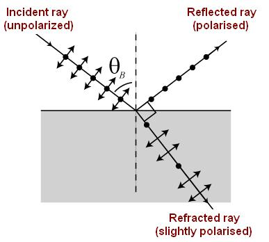

### Theory

<iframe width="560" height="315" src="https://www.youtube.com/embed/ZlvAfXaG97E" frameborder="0" allow="autoplay; encrypted-media" allowfullscreen></iframe>

An ordinary light source consists of a very large number of randomly oriented atomic emitters. They  radiate polarized wavetrains for roughly 10-8 s. These wavetrains combine to form a single resultant polarized wave which persists for a short time, not more than 10-8 s. Since natural light composes of a large number of rapidly varying succession of the different polarization states it is said to be an unpolarised or randomly polarized light.

  

 

The natural light can be expressed in terms of two arbitrary, incoherent, orthogonal, linearly polarized waves of equal amplitude.  Figure (a) shows randomly polarized natural light and figure (b) shows the splitting at 50% horizontal and 50% vertical states.

A light is said to be a plane polarised light, if all the vibrations are confined to a single plane. Consider an unpolarised light  incidents on a transparent surface. If the angle of incidence is equal to a particular angle of incidence, the reflected light produced  will be completely plane polarized.  This particular angle is called the Brewster's angle or the polarizing angle $\theta_{B}$.

Sir David Brewster, in 1892, found that the maximum polarization of the reflected ray occurs  when the reflected ray is perpendicular to the refracted ray.  This is called the  Brewster's law.

$$r=90^{0}-\theta_{B}$$

 

   ### Brewster's equation

   
$$\tan \theta_{B}=\frac{\mu_{2}}{\mu_{1}}$$

Where, $\mu_{2}$ is the  refractive index of the reflecting surface and $\mu_{1}$ is the refractive index of the surrounding medium. The refracted ray so produced will be partially polarized. As the refractive index changes the polarizing angle differs but it is independent of the wavelength of light used.

